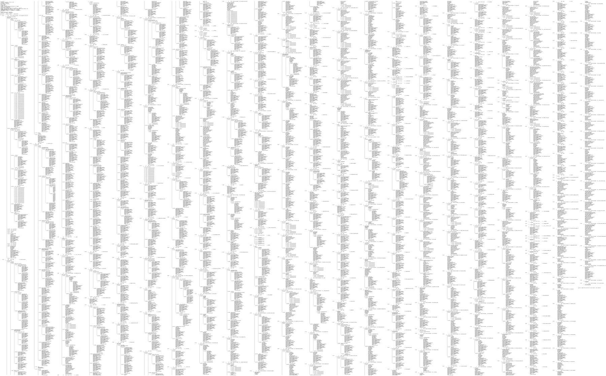
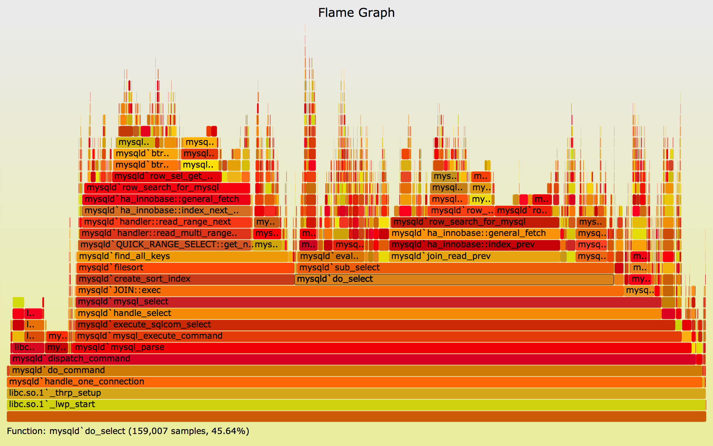
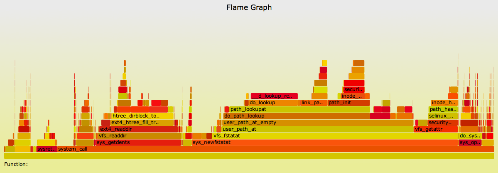
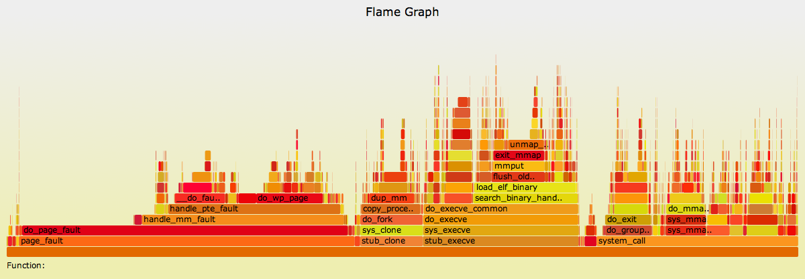
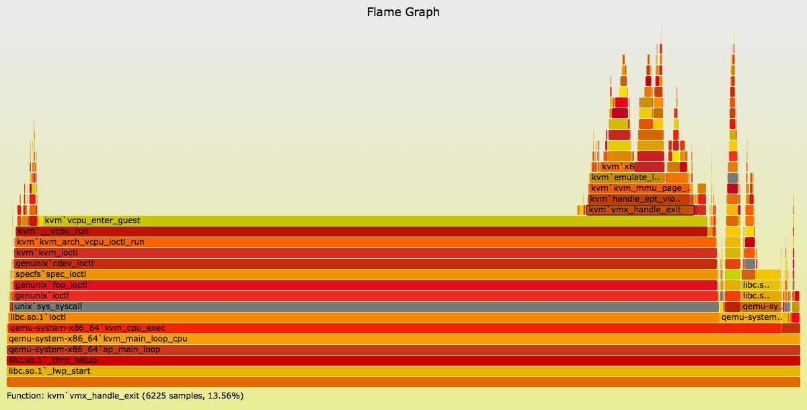
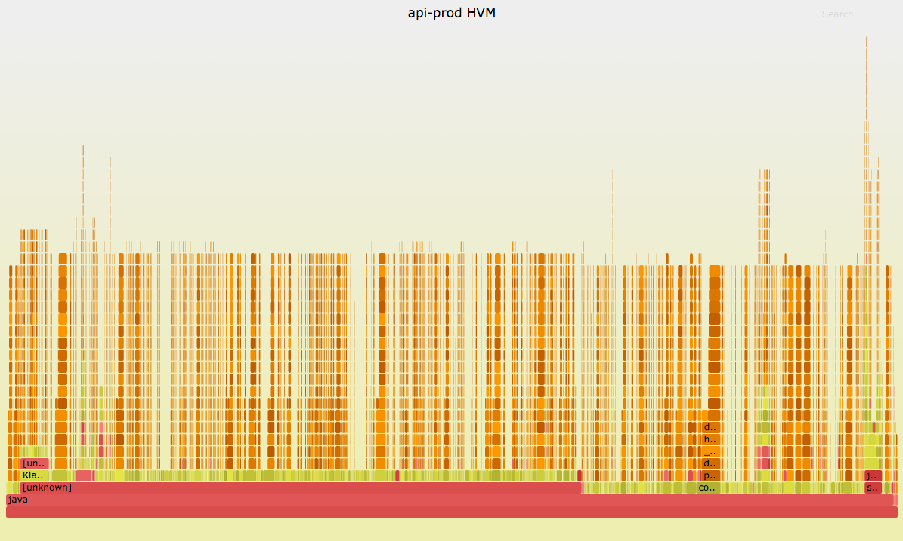
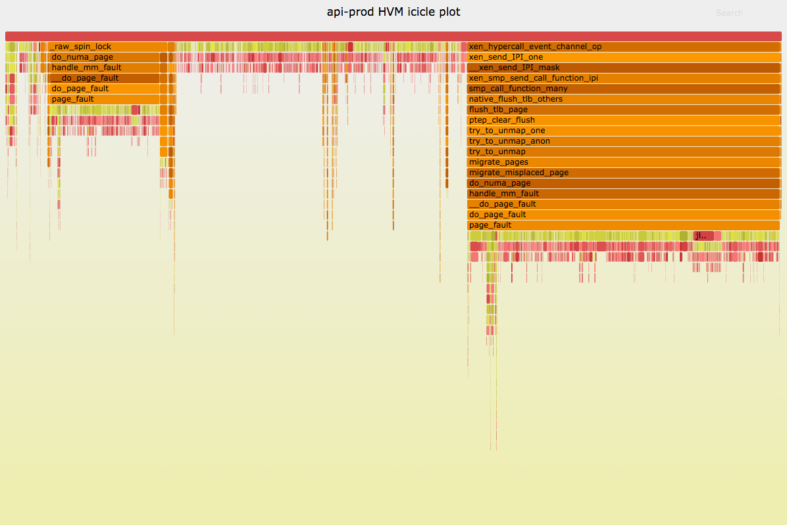
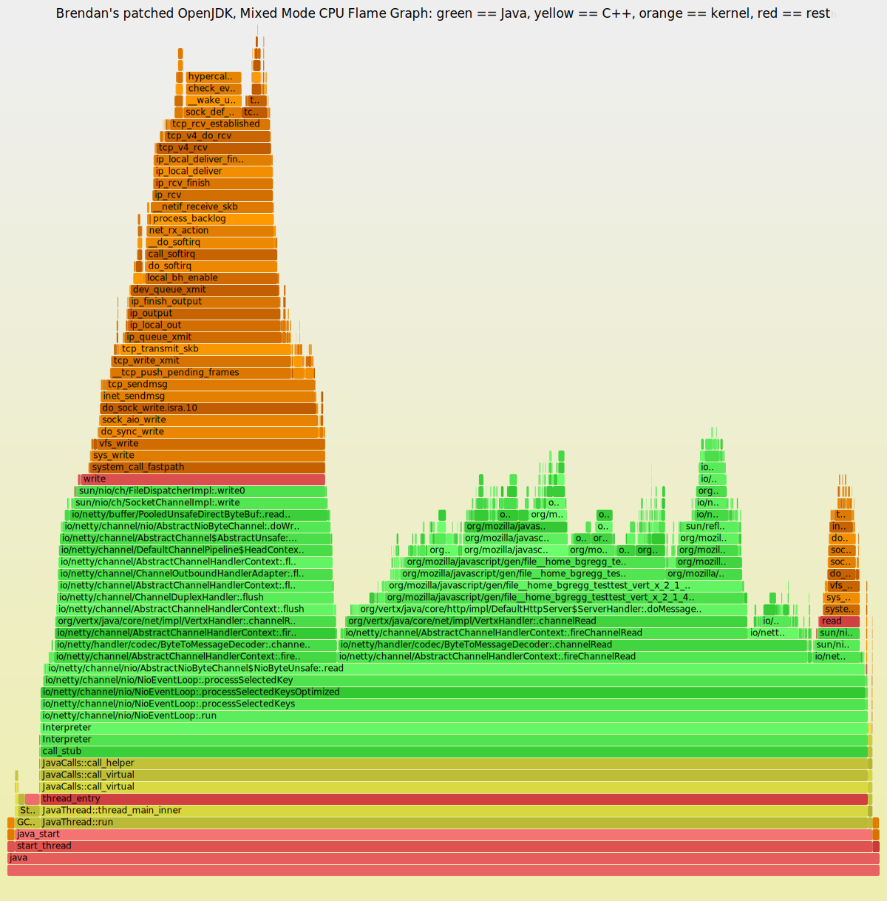
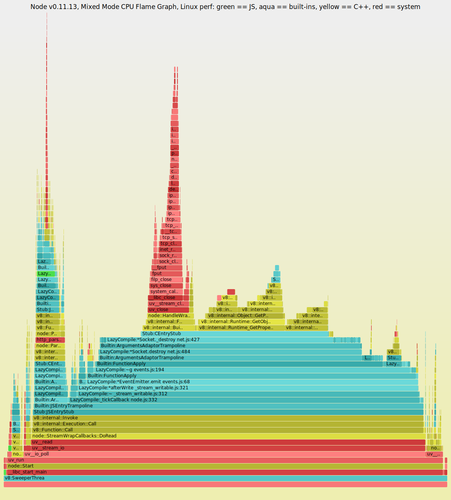

# CPU Flame Graphs

Determining why CPUs are busy is a routine task for performance analysis, which often involves profiling stack traces. Profiling by sampling at a fixed rate is a coarse but effective way to see which code-paths are hot (busy on-CPU). It usually works by creating a timed interrupt that collects the current program counter, function address, or entire stack back trace, and translates these to something human readable when printing a summary report.

Profiling data can be thousands of lines long, and difficult to comprehend. _Flame graphs_ are a visualization for sampled stack traces, which allows hot code-paths to be identified quickly. See the [Flame Graphs](https://www.brendangregg.com/flamegraphs.html) main page for uses of this visualization other than CPU profiling.

Flame Graphs can work with any CPU profiler on any operating system. My examples here use Linux perf (perf_events), DTrace, SystemTap, and ktap. See the [Updates](https://www.brendangregg.com/flamegraphs.html#Updates) list for other profiler examples, and [github](https://github.com/brendangregg/FlameGraph) for the flame graph software.

On this page I'll introduce and explain CPU flame graphs, list generic instructions for their creation, then discuss generation for specific languages.

# 1. Problem

Here I'm using Linux [perf](https://www.brendangregg.com/perf.html) (aka perf_events) to profile a bash program that is consuming CPU:

```
# perf record -F 99 -p 13204 -g -- sleep 30
# perf report -n --stdio
```

The perf record command sampled at 99 Hertz (-F 99), on our target PID (-p 13204), and captured stack traces (-g --) for call graph info.

The perf report command does a good job of summarizing the hundreds of stack trace samples as text. Similar code paths are coalesced, and the summary is shown as a tree graph, with percentages on each leaf. Read paths from top left to bottom right, which follows a code path's ancestry (and its stack trace sample). The percentages must be multiplied to determine a full stack trace's absolute frequency.

The first stack trace shown (which includes do_redirection_internal()), accounts for only 2% of the samples. The next stack trace (including execute_builtin_or_function()), 1%. So after reading this screen of text, we can only account for 3% of the samples. In order to understand where the bulk of the CPU time is spent, we'll want an idea of the code path for over 50% of the samples. We might need to do a lot more reading.

## 1.1. Too Much Data

The above output has been truncated, and only shows 45 lines from over 8,000 lines of output. The full output, visualized, looks like this:



Can you see the earlier two stacks? They are in the top left. Sometimes, the bulk of the CPU time is in a single code path, and perf report summarizes this easily on a single screen. However, often you need to read many screen fulls of text to understand the profile, which is time consuming and tedious.

# 2. The Flame Graph

Now the same data show previously as a flame graph:


With the flame graph, all the data is on screen at once, and the hottest code-paths are immediately obvious as the widest functions.

# 3. Description

I'll explain this carefully: it may look similar to other visualizations from profilers, but it is different.

*   Each box represents a function in the stack (a "stack frame").
*   The **y-axis** shows stack depth (number of frames on the stack). The top box shows the function that was on-CPU. Everything beneath that is ancestry. The function beneath a function is its parent, just like the stack traces shown earlier. (Some flame graph implementations prefer to invert the order and use an "icicle layout", so flames look upside down.)
*   The **x-axis** spans the sample population. It does _not_ show the passing of time from left to right, as most graphs do. The left to right ordering has no meaning (it's sorted alphabetically to maximize frame merging).
*   The width of the box shows the _total_ time it was on-CPU or part of an ancestry that was on-CPU (based on sample count). Functions with wide boxes may consume more CPU per execution than those with narrow boxes, or, they may simply be called more often. The call count is not shown (or known via sampling).
*   The sample count can exceed elapsed time if multiple threads were running and sampled concurrently.

The colors aren't significant, and are usually picked at random to be warm colors (other meaningful palettes are supported). This visualization was called a "flame graph" as it was first used to show what is hot on-CPU, and, it looked like flames. It is also interactive: mouse over the SVGs to reveal details, and click to zoom.

# 4. Instructions

The code to the [FlameGraph tool](https://github.com/brendangregg/FlameGraph) and instructions are on github. It's a simple Perl program that outputs SVG. They are generated in three steps:

1.   Capture stacks
2.   Fold stacks
3.   flamegraph.pl

The first step is to use the profiler of your choice. See below for some examples using perf, DTrace, SystemTap, and ktap.

The second step generates a line-based output for flamegraph.pl to read, which can also be grep'd to filter for functions of interest. There are a collection of simple Perl programs to do this, named stackcollapse*.pl, to process the output from different profilers. Newer versions of Linux perf and eBPF profile(8) can do steps (1) and (2) at the same time (explained in the following sections).

## 4.1. Linux perf

Linux perf has a variety of capabilities, including CPU sampling. Using it to sample all CPUs and generate a flame graph:

```bash
git clone https://github.com/brendangregg/FlameGraph
cd FlameGraph
perf record -F 99 -a -g -- sleep 60
perf script | ./stackcollapse-perf.pl > out.perf-folded
./flamegraph.pl out.perf-folded > perf.svg
firefox perf.svg  # or chrome, etc.
```

The perf record command samples at 99 Hertz (-F 99) across all CPUs (-a), capturing stack traces so that a call graph (-g) of function ancestry can be generated later.

## 4.2. eBPF profile

My profile(8) tool in [bcc](https://github.com/iovisor/bcc) does in-kernel aggregations of sampled stack traces, so that only the summary is emitted to user space. profile(8) can even print that summary in folded format directly. This can be much more efficient than using perf(1).

```bash
git clone https://github.com/brendangregg/FlameGraph
apt-get install bpfcc-tools
cd FlameGraph
profile-bpfcc -F 99 -adf 60 > out.profile-folded
./flamegraph.pl --colors=java out.profile-folded > profile.svg
```

## 4.3. DTrace

DTrace can be used to profile on-CPU stack traces on systems that support it (Solaris, BSDs). The following example uses DTrace to sample user-level stacks at 99 Hertz for processes named "mysqld":

```bash
git clone https://github.com/brendangregg/FlameGraph
cd FlameGraph
dtrace -x ustackframes=100 -n 'profile-99 /execname == "mysqld" && arg1/ { @[ustack()] = count(); } tick-60s { exit(0); }' -o out.stacks
./stackcollapse.pl out.stacks > out.folded
./flamegraph.pl out.folded > out.svg
```

# 5. Examples

## 5.1. MySQL

This is the original performance issue that led me to create flame graphs. It was a production MySQL database which was consuming more CPU than hoped.

The problem was that most of the output was truncated from this screenshot ("[...]"), and (unlike Linux perf), DTrace doesn't print percentages, so you aren't sure how much these stacks really matter.

The full output was 591,622 lines long, and included 27,053 stacks. It looks like this:


The same MySQL profile data, rendered as a flame graph:



You can mouse over elements to see percentages (but not click-to-zoom, as this is an old version), showing how frequent the element was present in the profiling data.

The earlier truncated text output identified a MySQL status stack as the hottest. The flame graph shows reality: most of the time is really in JOIN::exec. This pointed the investigation in the right direction: JOIN::exec, and the functions above it, and led to the issue being solved.

## 5.2. File Systems

As an example of a different workload, this shows the Linux kernel CPU time while an ext4 file system was being archived:



This shows how the file system was being read and where kernel CPU time was spent. Most of the kernel time is in sys_newfstatat() and sys_getdents(): metadata work as the file system is walked.

## 5.3. Short Lived Processes

For this flame graph, I executed a workload of short-lived processes to see where kernel time is spent creating them:



Apart from performance analysis, this is also a great tool for learning the internals of the Linux kernel.

## 5.4. User+Kernel Flame Graph

This example shows both user and kernel stacks on an illumos kernel hypervisor host:



You can also see the standalone [SVG](../assets/cpuflamegraphs/cpu-qemu-both-57f84c89.svg) version. This shows the CPU usage of qemu thread 3, a KVM virtual CPU. Both user and kernel stacks are included (DTrace can access both at the same time), with the syscall in-between colored gray.

## 5.5. NUMA Rebalancing

Sometimes flame graphs look busted until you invert the merge order.

Netflix was rolling out a new Ubuntu version (14.04 Trusty, with its Linux 3.13 kernel) when a service encountered high CPU usage after a few hours.



Having "hair" on a flame graph is typically a sign of kernel interrupt load. Interrupts can occur at any time, adding a short burst of CPU cycles, as well as a deep stack trace, on top of any application code.

Using both of the following options switches the merge order and visualization order:

```bash
flamegraph.pl --reverse --inverted
```

Which produces:



Ah-ha! Now I can see that this is indeed the same interrupt: These two "towers" alone add up to 55% of all samples. The hair has been merged.

The problem was NUMA rebalancing in this Ubuntu release goes haywire, spending more than half the CPU cycles to better balance memory between nodes for performance.

# 6. Java

My JavaOne 2016 talk [Java Performance Analysis on Linux with Flame Graphs](http://www.slideshare.net/brendangregg/java-performance-analysis-on-linux-with-flame-graphs) summarizes the latest technique to use Linux perf to generate mixed-mode flame graphs.

## 6.1. Linux perf_events

One approach to solve the problems involves:

1.   A JVMTI agent, [perf-map-agent](https://github.com/jvm-profiling-tools/perf-map-agent), which can provide a Java symbol table for perf to read (/tmp/perf-PID.map).
2.   The -XX:+PreserveFramePointer JVM option, so that perf can walk frame pointer-based stacks.

Steps:

```bash
# 1. Install perf-map-agent
sudo bash
apt-get install cmake
export JAVA_HOME=/path-to-your-new-jdk8
cd /destination-for-perf-map-agent
git clone --depth=1 https://github.com/jvm-profiling-tools/perf-map-agent
cd perf-map-agent
cmake .
make

# 2. Profile and flame graph generation
git clone --depth=1 https://github.com/brendangregg/FlameGraph
sudo bash
perf record -F 49 -a -g -- sleep 30; ./FlameGraph/jmaps
perf script > out.stacks01
cat out.stacks01 | ./FlameGraph/stackcollapse-perf.pl --all | grep -v cpu_idle | \
    ./FlameGraph/flamegraph.pl --color=java --hash > out.stacks01.svg
```

Note that jmaps (a helper script that calls perf-map-agent to do symbol dumps) runs immediately after perf record, to minimize symbol churn.

An example resulting flame graph:



When running flamegraph.pl I used --color=java, which uses different hues for different types of frames. Green is Java, yellow is C++, orange is kernel, and red is the remainder (native user-level, or kernel modules).

## 6.2. Java async-profiler

The [Java async-profiler](https://github.com/jvm-profiling-tools/async-profiler) is a newer method that uses Linux perf and matches frames with JVMTI calls to AsyncGetCallTrace. An advantage is that it does not require -XX:+PreserveFramePointer, which can cost some overhead (usually < 1%).

# 7. Node.js

Profiling v8 has similar issues to Java. We ideally would like some profiler that can sample both system code-paths and v8 JavaScript code-paths.

## 7.1. Linux perf

Linux [perf_events](https://www.brendangregg.com/FlameGraphs/perf.html) can profile JavaScript stacks, when using the v8 option --perf_basic_prof or --perf_basic_prof_only_functions.

Here is an example Linux perf CPU flame graph:



This uses --color=js to use different hues: green == JS, aqua == built-ins, yellow == C++, red == system (native user-level, and kernel).

# 8. Other Uses

The flame graph visualization works for any stack trace plus value combination, not just stack traces with CPU sample counts like those above. For example, you could trace device I/O, syscalls, off-CPU events, specific function calls, and memory allocation. For any of these, the stack trace can be gathered, along with a relevant value: counts, bytes, or latency.

# 9. Background & Acknowledgements

I created this visualization out of necessity: I had huge amounts of stack sample data from a variety of different performance issues, and needed to quickly dig through it. I first tried creating some text-based tools to summarize the data, with limited success. Then I remembered a time-ordered visualization created by [Neelakanth Nadgir](http://blogs.sun.com/realneel/entry/visualizing_callstacks_via_dtrace_and), and thought stack samples could be presented in a similar way. Neel's visualization looked great, but the process of tracing every function entry and return for my workloads altered performance too much. In my case, what mattered more was to have accurate percentages for quantifying code-paths, not the time ordering. This meant I could sample stacks (low overhead) instead of tracing functions (high overhead).

The very first visualization worked, and immediately identified a performance improvement to our KVM code (some added functions were more costly than expected). I've since used it many times for both kernel and application analysis, and others have been using it on a wide range of targets, including node.js profiling. Happy hunting!

# 10. References

*   The [Flame Graph](https://www.brendangregg.com/flamegraphs.html) page, and [github repo](https://github.com/brendangregg/FlameGraph)
*   Linux perf_events [wiki](https://perf.wiki.kernel.org/)
*   The Unofficial Linux Perf Events [Web-Page](http://web.eecs.utk.edu/~vweaver1/projects/perf-events/)
*   The SystemTap [homepage](http://sourceware.org/systemtap/)
*   My [Linux Performance Checklist](https://www.brendangregg.com/USEmethod/use-linux.html), which includes perf_events, SystemTap and other tools

See the [Flame Graph: Updates](https://www.brendangregg.com/flamegraphs.html#Updates) section for other articles, examples, and instructions for using flame graphs on many other targets, including Ruby, OS X, Lua, Erlang, node.js, and Oracle.

---

_Last updated: 30-Aug-2021_

Copyright 2021 Brendan Gregg
