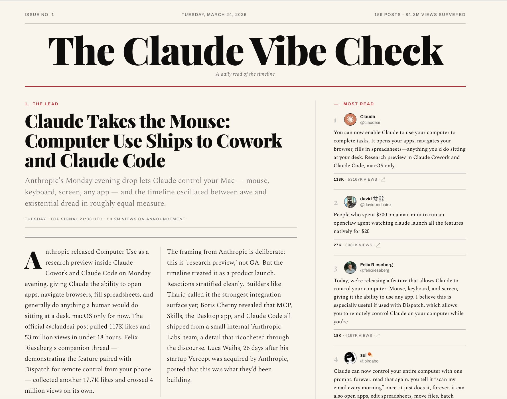
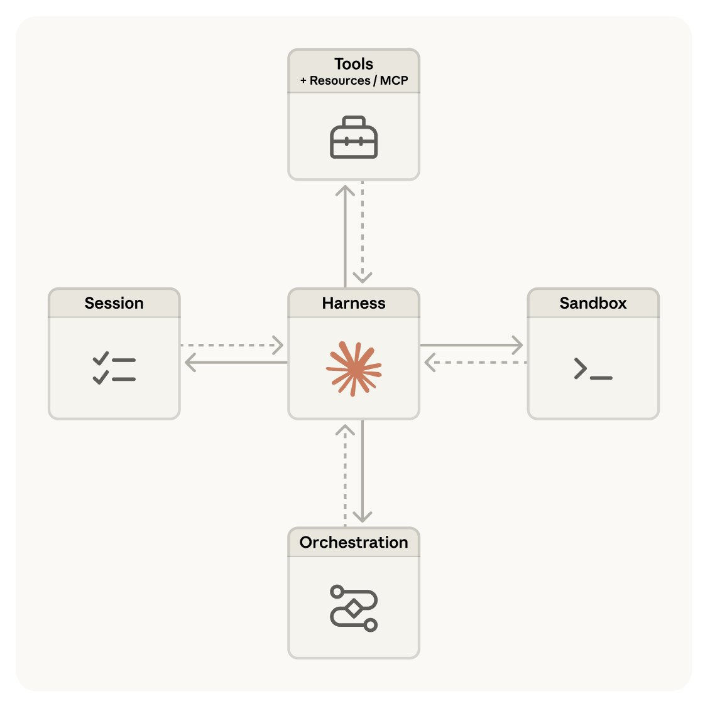

[](https://x.com/RLanceMartin/article/2041927992986009773/media/2041921746375524353)

Launching Claude Managed Agents

TL;DR – Claude Managed Agents is a pre-built, configurable agent harness that runs in managed infrastructure. You define an agent as a template – tools, skills, files / repos, etc. The agent harness and the infrastructure are provided for you. The system is designed to keep pace with Claude's rapidly growing intelligence and support long horizon tasks. Some useful links:

*   : Usage patterns and customer examples 
*   : The design of Claude Managed Agents 
*   : Onboarding, quickstart, overview of the CLI and SKDs 

Why Claude Managed Agents

The Claude

is a direct gateway to the model: it accepts messages and returns content blocks. Agents built on the messages API use a harness to route Claude's tool calls to handlers and manage context. This poses a few challenges:

*   Harnesses need to keep up with Claude – I recently wrote a blog

focused on building agents using Claude API primitives to handle tool orchestration and context management. But agent harnesses encode assumptions about what Claude can't do. These assumptions grow stale as Claude gets more capable and can

Claude's performance. Harnesses need to be continually updated to keep pace with Claude. 
*   Claude is running for longer – Claude's

, already exceeding over 10 human-hours of work on the METR benchmark. This puts pressure on the infrastructure around an agent: it needs to be safe, resilient to infrastructure failures that happen over long horizon tasks, and support scaling (e.g., to many agent teams). 

Addressing these challenges is important because we expect future Claude to run over days, weeks, or months on humanity's greatest challenges. The

was a first step, providing an excellent general purpose agent harness. Claude Managed Agents is the next step in this progression: a system with the harness and managed infrastructure designed to support safe, reliable execution over the time-horizon that we expect Claude to work.

How to get started

An easy way to onboard is to use our open source

, which works out of the box in Claude Code. Get the latest version of Claude Code and run the following sub-command for Claude Managed Agents onboarding. I'm excited about skills as a way to onboard to new features, and have used this skill extensively:

```
$ claude update
$ claude
/claude-api managed-agents-onboarding
```

Also see our

for quickstart with the SDKs or CLI, and prototype agents

.

Use cases

You can see our

for a number of interesting examples. Some of the common patterns I've noticed across these examples and my own work:

*   Event-triggered: A service triggers the Managed Agent to do a task. For example, a system flags a bug and a managed agent writes the patch and opens the PR. No human in the loop between flag and action.

*   Scheduled: Managed Agent is scheduled to do a task. For example, I and many others use this pattern for scheduled daily briefs (e.g., of X or Github activity, what a team of agents is working on). Here's an example daily brief of X activity that I use.

[](https://x.com/RLanceMartin/article/2041927992986009773/media/2041914002322898944)

*   Fire-and-forget: Humans trigger the Managed Agent to do a task. For example, assign tasks to the Managed Agent via Slack or Teams and get back deliverables (spreadsheets, slides, apps).

*   Long-horizon tasks: Long-running tasks are an area where I think Managed Agents will be particularly useful. I've explored this by forking

's auto-research repo and exploring a few different ideas. For example, I recently took

's excellent

and had a Managed Agent explore ways to apply it to our engineering blog content. 

The media could not be played.

Key concepts

When onboarding, there's three central concepts to understand:

*   Agent — A versioned config that houses the agent's identity: model, system prompt, tools, skills, MCP servers, etc. You create it once and reference it by ID.

*   Environment — A template describing how to provision the sandbox the agent's tools run in (e.g., runtime type, networking policy, and package config).

*   Session — A stateful run using the pre-created agent config and environment. It provisions a fresh sandbox from the environment template, mounts any per-run resources (files, GitHub repos), stores auth in a secure vault (MCP credentials).

Think about an agent as a configuration, an environment as a template describing the sandbox you want the agent to access for code execution, and the session as any agent execution. One agent can have many sessions.

Usage

See

here:

*   – These are code-facing: import them in your app to drive sessions at runtime. Six languages have Managed Agents support: Python, TypeScript, Java, Go, Ruby, PHP. 
*   – Terminal-facing: every API resource (agents, environments, sessions, vaults, skills, files) is exposed as a subcommand. 
*   Common patterns – Use the CLI for setup and SDK for runtime. Agents templates are persistent: you create one, store it (e.g., as a YAML with model, system prompt, tools, MCP servers, skills in git) and have the CLI apply it in your deploy pipeline.

How it works

I wrote an Anthropic engineering

with

,

, and

on the process of building Claude Managed Agents: a lesson we share in the post is that building agents to scale with Claude's intelligence is an infrastructure challenge, not strictly a matter of harness design.

[](https://x.com/RLanceMartin/article/2041927992986009773/media/2041915446103019520)

With this in mind, we didn't design a particular agent harness; we expect agent harnesses to constantly evolve. Instead we decouple what we thought of as the "brain" (Claude and its harness) from both the "hands" (sandboxes and tools that perform actions) and the "session" (the log of session events).

Each became an interface that made few assumptions about the others, and each could fail or be replaced independently. We share how this gives the system reliability, security, and flexibility to add future harnesses, sandboxes, or infrastructure to house sessions.

Conclusion

I'm excited about projects exploring different patterns of multi-agent orchestration or long-running tasks. One of the frustrations

is keeping agent harnesses up with model capabilities. Claude Managed Agents handles the agent harness and infrastructure for you, allowing for explorations on top of the agent as a new core primitive in the Claude API.
